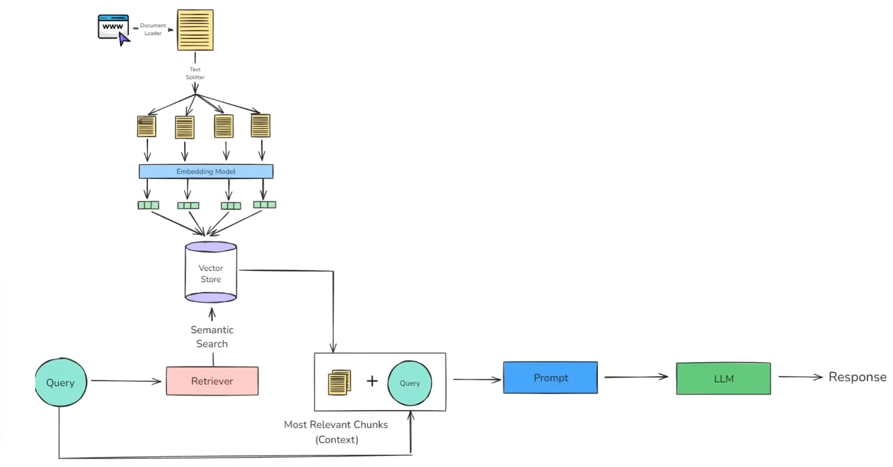

# 🎥 YouTube Chatbot with LangChain & OpenAI

This project is a smart chatbot that extracts transcript data from YouTube videos and uses AI to answer questions or summarize the content. It uses **LangChain**, **OpenAI GPT**, and **FAISS** for retrieval-augmented generation (RAG).

---

## 🚀 Features

- ✅ Extracts YouTube video transcripts
- ✅ Splits and embeds transcript chunks
- ✅ Stores them in a FAISS vector database
- ✅ Answers questions using relevant video content
- ✅ Summarizes the entire video
- ✅ Responds only if context is sufficient

---

System Architecture:




## 🧠 Tech Stack

- **Python**
- **LangChain**
- **OpenAI GPT-4o (or GPT-3.5)**
- **FAISS** – Vector similarity search
- **YouTubeTranscriptAPI**
- **RecursiveCharacterTextSplitter** – For breaking text into chunks

---

## 📦 Installation

```bash
pip install youtube-transcript-api langchain-community langchain-openai \
            faiss-cpu tiktoken python-dotenv
```

🔐 Setup
Get an OpenAI API key from OpenAI Platform.

Create  .env file and add:
```
OPENAI_API_KEY=your_openai_key_here
```

📄 Usage
Update the video_id variable in the script:
```
video_id = "Gfr50f6ZBvo"  # Example: CampusX video
```
Then run the script. It will:
1)Fetch and clean the transcript
2)Split and embed the text
3)Store embeddings in FAISS

Use semantic search to answer user queries like:
1)"What is stack?"
2)"Is nuclear fusion discussed in this video?"
3)"Summarize the video"

📌 Example Prompt

main_chain.invoke("Summarize the video")
main_chain.invoke("How is stack implemented?")

📚 Resources Used
LangChain Docs

OpenAI API

YouTube Transcript API

FAISS by Facebook

🧠 Future Ideas
Add support for multilingual transcripts

Deploy as a web app (Streamlit or Flask)

Add caching for reused videos

Integrate with Gemini or Claude APIs


